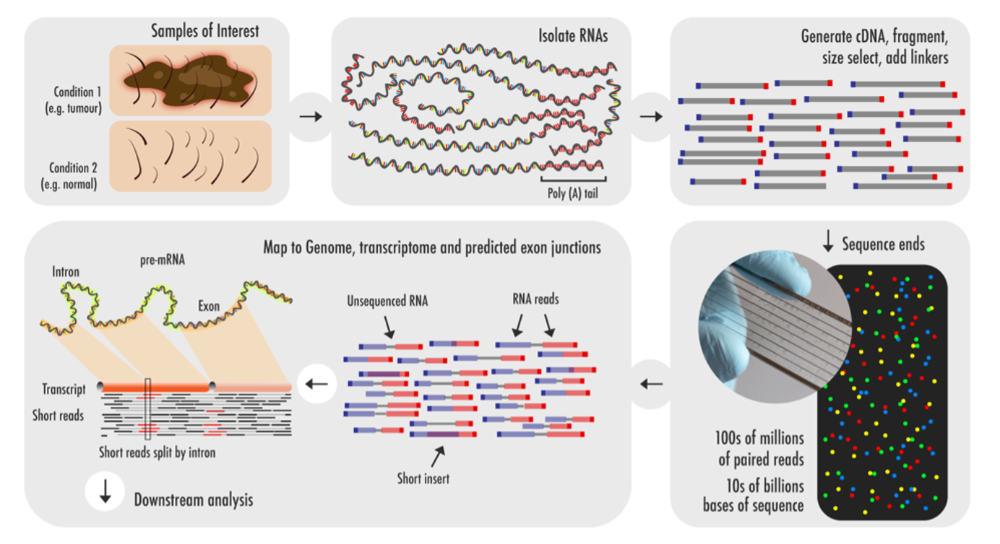
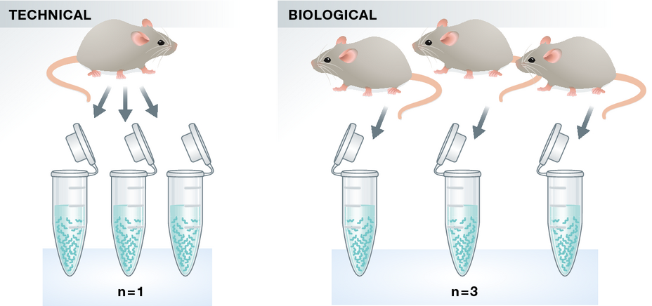
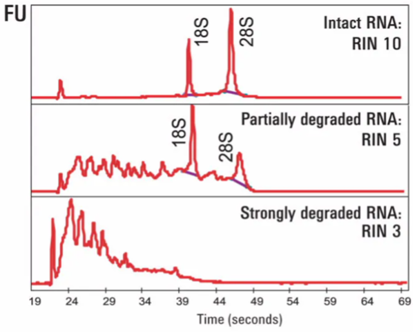
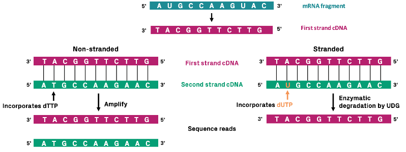
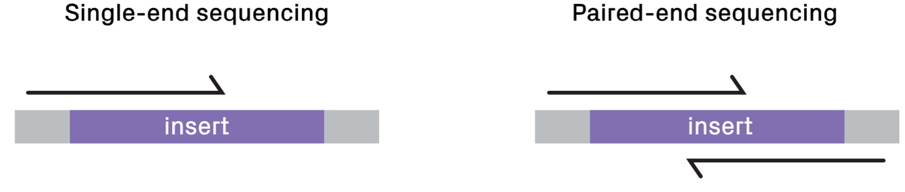

```{r setup, include=FALSE}
library(kableExtra)
knitr::opts_chunk$set(echo = TRUE, fig.align = 'center', warning = FALSE, message = FALSE)
```

## Objectives
- _Setup RStudio or Posit_
- _Get familiar with the Posit interface_
- _Learn about bulk RNA-seq data processing_
- _Download the data needed for the workshop_

# Setup
## Using Rstudio or Posit
If RStudio is not installed on your computer, you can create a free account on [_posit.cloud_](https://posit.cloud/). Create the account with your credentials and **follow the instructions to create a new project**. Once done, you should see something like this on your screen:

<center>


</center>

This is your working interface, the **bottom right section** shows your _current file system_ (on the cloud) which is now pointed to the place where the `Rproject` you just created lives. The **section on the left currently displays your console**, where **you can type `R` code _interactively_**. 

## Communicating with R
You should see your cursor on the left-hand side of the screen blinking. That window represents the **_`R` console_**. It can be used to "talk" with R through commands that it can understand!

### Printing Text
For example, try typing the following in the console and check what comes out (a.k.a. the _output_):

```{r}
# Tell R to print out some words on screen with the "print" command
print("Hello World!")
```

### Creating Variables
One of the main aspects of any programming language including `R` is the ability to create _**variables**_. You can think of variables as ways to _store_ objects under any given name. Let's take the previous example and store the `Hello World!` character (known as a _string_) in a variable that we call `my_variable`. The creation of a variable in `R` is classically done through the _assignment operator_ `<-`.

```{r}
# Let's assign the statement to a variable (nothing happens when running this code)
my_variable <- "Hello World!"

# Let's display the content of the new variable!
print(my_variable)
```

> 💡
> **What happened in the top right part of your screen when you ran the code lines above? Check out the "environment" section, you should see that `my_variable` appeared there!**

### Mathematical Operations
As we said, the `R` language was built with statistics in mind, hence we can use it to perform mathematical operations with ease, much like a calculator.

```{r}
print(6 / 2)
```

### Data Types: Vectors and Lists
In `R`, numbers, text and combination of the two can be represented in either vectors or lists. You can think of lists as an extension of vectors where elements can be heterogeneous and named. Let's create a vector with numbers (with the `c()` command) and use it to display the way that **functions** work in `R`.

```{r}
myvector <- c(1,2,3,4)
```

Let's find the mean value of this vector! Now we can either do this manually by summing all its elements and divide by their number, or we can use a function to do so, intuitively enough, the function we can use is the `mean()`.

```{r}
mean(myvector)
```

> 💡 You can think of functions as a small piece of code that does something that normally would be done many times by repeating the code itself. Functions avoid the need for code repetition. We will acounter many functions later on, simple ones and very complex ones!

### Data Types: Tables
Without going too much into the details of all the available objects used to store data in `R`, one of the most abundantly used is the `data.frame`. Think of `data.frame`s as the `R` equivalent of Excel spreadsheets, so **a way to store _tabular_ data**. As we will see later, pretty much all the data we are going to handle will be in the form of a `data.frame` or some of its other variations.

```{r}
# Let's create and display a data frame (a table) with four rows and two columns
data.frame("Class"=c("a","b","c","d"), # First column
            "Quantity"=c(1,10,4,6)) # Second column
```

You have now instructed `R` to do something for you! We will ask it to do plenty more in the code chunks below!

## Creating a script
In the console we can type as many commands as we want and execute them sequentially. Nevertheless, **commands typed in the console are lost the moment they are executed** and if we want to execute them again we need to type everything back in the console... **this is painful**!

A **_script_ is just a normal text file which groups a series of commands that R can execute sequentially**, reading the file line-by-line. This is much better because we can then **edit the file and save the changes**!

Follow the movie below to create an `R` script in Posit, the same applies to Rstudio, notice the `.R` extension at the end of the file name.

<center>


</center>


The new window that appeared on the upper left represents your R script. **In here we can write R code which DOES NOT get executed immediately like in the console before**. 

> 💡
> **In order to execute code from the script, highlight the code line you want to execute (or put your cursor line on it) and press <kbd>⌘</kbd>+<kbd>Enter</kbd> on Mac or <kbd>Ctrl</kbd>+<kbd>Enter</kbd> on Windows.**

## Installing packages
The analyses that we are going to conduct require specific **packages**. In R, **packages are _collections of functions_** which help us perform standardized workflows. In the **code chunk** below, we instruct R to install the packages that we will need later on throughout the workshop.

> 💡
> **Copy and paste this and the other _code chunks_ from here to your R script to follow.**

```{r, eval=FALSE}
# Install packages from Bioconductor
if (!require("BiocManager", quietly = TRUE))
  install.packages("BiocManager")
BiocManager::install()

# Install packages from CRAN
install.packages("tidyr")
install.packages("dplyr")
install.packages("googledrive")

# For differential expression
BiocManager::install("vsn")
BiocManager::install("edgeR")
install.packages("statmod")

# For visualizations
install.packages("hexbin")
install.packages("pheatmap")
install.packages("RColorBrewer")
install.packages("ggrepel")
install.packages("ggpubr")

# For conversion between gene IDs
BiocManager::install("org.Hs.eg.db")

# For downstream analyses
install.packages("msigdbr")
BiocManager::install("fgsea")
BiocManager::install("clusterProfiler")

# Remove garbage
gc()
```

During the installation, you will see many messages being displayed on your _`R` console_, don't pay too much attention to them unless they are <span style="color: red;">red and specify an error</span>!

If you encounter any of these messages during installation, follow this procedure here:

```{r, eval=FALSE}
# R asks for package updates, answer "n" and type enter
# Question displayed:
Update all/some/none? [a/s/n]:

# Answer to type:  
n

# R asks for installation from binary source, answer "no" and type enter
# Question displayed:
Do you want to install from sources the packages which need compilation? (Yes/no/cancel)

# Answer to type:
no
```

Hopefully all packages were correctly installed and now we can dive a bit deeper into the theoretical basics of RNA sequencing!

# Introduction to bulk RNA-seq
With bulk RNA sequencing technologies, the goal is to capture **average gene expression levels** across pooled cell populations of interest. This is achieved by capturing all RNA transcripts from a sample and sequencing them in an automated way to ensure the adequate throughput needed for answering the biological hypotheses behind the experiment. The main limitation of bulk RNA-seq is that we lose the ability to distinguish between gene expression profiles of rare cell populations.

> 🤔 What are the key differences between RNA sequencing and qPCR?

## Why bulk RNA sequencing?
The motivations behind an RNA sequencing experiment can be summarized between gathering a set of both **quantitative** but also **qualitative** observations.


| Quantitative 	| Qualitative 	|
|---	|---	|
| Identify _differentially expressed_ genes 	| _Annotate_ transcripts 	| 
| Detect different _Isoform_	expression | _Alternative splicing_ analysis	|
|  	| Identify _gene fusion_ events |


<center>


</center>


## Experimental Workflow

A bulk RNA-seq experiment is articulated in the following steps:

- **Experimental design**: sample choice and hypothesis

- **RNA extraction**

- **cDNA preparation**: retrotranscription of RNA molecules

- **Library preparation**: fragmentation of cDNA molecules and ligation of adapters

- **Sequencing**

- **Data processing**: raw read QC

- **Data analysis**: extract meaningful biological insights


<center>



</center>

## How can we design a bulk RNA-seq experiment?
A well thought-out experimental design is a crucial factor in achieving success. The best strategy will primarily depend on the experiment's goals, the hypotheses being tested, and the type of data expected to be obtained.

### Replicates
Replication is a key part of the scientific method and bulk RNA-seq experiments are no exception to the norm. Guideline suggest to perform 2-5 replicates for each condition of interest!

> 🤔 Do you know what the differences between a _technical_ and _biological_ replicates are?


<center>



</center>


**Technical Replicates**: use the _same_ biological specimen (sample) from the _same_ experimental condition to repeat the technical or experimental steps in order to accurately measure technical variation and remove it during analysis. These are normally dispensable given the low technical variation with NGS technologies.

**Biological Replicates**: use _different_ biological samples of the _same_ condition to measure the biological variation between samples. Of key importance for the analysis. The higher the number of biological replicates, the more precise the estimate of average gene expression. They’re even more important than sequencing depth in defining differentially expressed genes with confidence.

### Avoiding _batch_ effects!
Batch effect refers to the **unwanted variability** in data that arises due to differences in how samples are processed, handled, or analyzed across different experimental batches or conditions, rather than being due to the biological variation of interest. 

Sources of batch effect can arise from: 

- sample collection strategies
- processing differences 
- equipment and instrumentation
- library preparation time
- sequencing time

> 💡 If you cannot avoid batch effects, do not confound you experiment by batch but instead **randomize samples across batches**!

What follows is a basic yet intuitive visualization of what the above phrase means in practice... in a **poorly-designed** experiment:

<center>


</center>

And in a **well-designed** experiment with following analyses in mind:

<center>


</center>

This approach ensures that any potential batch effects — such as differences in RNA extraction, handling, or processing — are equally represented in both the control and treatment groups, thereby helping to **isolate biological variation from technical noise**.

**e.g** If you need to extract RNA in two batches due to the number of samples, avoid extracting only control samples in one batch and only treated samples in the second one. Doing so could introduce batch-specific technical variations that would make it difficult to differentiate between true biological differences and technical artifacts. Instead, ensure that you equally distribute control and treated samples across both batches. 

> 🤔 Could you think about another example of how to avoid batch effect in your experimental set up?

## How do we go from mRNA to sequences?

### Gathering RNA from cells
The first step is of course to materially extract RNA molecules from our set of cells of interest! 

Most commonly used extraction methods are **organic extraction methods** (phenol-containing solutions) or **filter-based** (membranes). 
Then, in order to _eliminate DNA contamination_ in your sample and increase RNA purity, DNAse treatment is performed. Certain forms of contamination can be detected using UV spectroscopy and the calculation of absorbance ratios. Good quality RNA will have an A260/280 ratio of 1.7 to 2.1 and A260/230 of 2.0 to 2.2. A260/280 lower than 1.7 may indicate protein contamination, whereas A260/230 less than 1.8 may indicate the presence of organics (e.g. phenol or guanidine) leftover from the extraction protocol.

> 🚨 Degradation of RNA breaks up long RNA molecules into shorter fragments, that are more difficult to assemble bioinformatically, and therefore RNA sequence information can be lost! 

Following that, RNA is quantified and its integrity evaluated (by agarose gel electrophoresis or by _Bioanalyzer_ or Tape station). With both methods you should recognize the most abundant RNAs in our cells: the ribosomal subunits 18S and 28S (that should be twice 18S). The image below shows 3 bioanalyzer profiles at decreasing levels of **RIN** (RNA Integrity Number).

<center>



</center>

> 🤔 Based on what we’ve said about batch effects, would you use the same RNA extraction protocol or different ones for your samples?

### Interested in different species of RNA?
As we know RNA can come in many forms and functions, so depending on your research interest, you might be prompted to look at specific RNA species over others. This means that we need to **enrich** for specific sets of RNA molecules among the many ones that cells produce to function! Below we can find a series of protocols optimized to capture different RNA species:

| Method 	| Application 	| Limitations |
|---	|---	|---	|
| Poly(A) selection 	| mRNA sequencing | Excludes non-polyadenilated species (rRNAs, tRNAs) 	|
| rRNA Depletion 	| mRNA, small RNAs and lncRNAs 	| Can reduce total RNA yield	|
| Total RNA-seq 	| Comprehensive transcriptome analysis 	| High rRNA content and reduced overall sensitivity	|
| miRNA Enrichment 	| Small RNA sequencing (miRNAs, snoRNAs, etc.)	| Excludes large RNAs, and only focuses on small RNA species	|
| Capture-based Enrichment 	| Targeted RNA sequencing 	| Only focuses on specific sequences, not suitable for global analysis	|

### Producing a _library_
Starting from our precious mRNA molecule that has been isolated from our sample, we transform it into DNA by means of _retrotranscription_, this process creates what is known as **cDNA**. cDNA molecules can be very large and due to technical constraints we need to fragment them into smaller pieces. All these pieces are then ligated to a set of sequences known as **adapters**. 

<center>


</center>

Importantly, Since there are many genomic regions that generate transcripts from both strands, **identifying the polarity of a given transcript** provides essential information about the possible function of a gene. 

However, in canonical **NON-STRANDED** library preparation random primers are used for first- and second-strand synthesis of cDNA. The resulting sequencing products from the two antisense transcripts are identical and cannot be distinguished when sequenced. Thus, information about directionality is lost during cDNA synthesis. 

<center>



</center>

On the contrary, **STRAND-SPECIFIC** library preparation distinguishes the first and second strands of cDNA by incorporating uracil instead of thymine to label the second strand. After adapter ligation, amplification of the second strand is blocked. This can be accomplished by performing uracil-specific digestion before amplification or by using a DNA polymerase that is unable to amplify uracil-containing templates. As a result, all sequencing products from a particular RNA molecule will have the same orientation.

### Next Generation Sequencing
Next Generation Sequencing technologies (Illumina/PacBio) allow experimenters to capture the entire genetic information in a sample in a completely unsupervised manner. The process works with an approach called **sequencing-by-synthesis** or SBS for short. 

> 💡
> **Great info can be found at the [Illumina Knowledge page](https://knowledge.illumina.com/software/general/software-general-reference_material-list/000002211)**

This means that **strands are sequenced by re-building them** using the natural complementarity principle of DNA with fluorescently labelled bases which get detected and decoded into sequences. On illumina _flow-cells_ this process happens in **clusters**, to allow for proper signal amplification and detection, as shown in the movie below.

<center>

<iframe width="560" height="315" src="https://www.youtube.com/embed/fCd6B5HRaZ8" title="Illumina SBS sequencing" frameborder="0" allow="accelerometer; autoplay; clipboard-write; encrypted-media; gyroscope; picture-in-picture; web-share" allowfullscreen></iframe>

</center>

As we have seen in the video, adapter sequences are used by the sequencing machine to hybridize cDNA fragments to the flow cell and form sequencing clusters.

A few key parameters to consider when using NGS technologies (and this holds true for all involved _omics_ approaches) include:

- **Sequencing Depth**: as the name suggests, this represents the final objective in terms of number of reads obained in the experiment, we can go shallow for a quick snapshot of highly expressed genes (5 to 30 million reads), or very deep to catch that rarely expressed variant we are interested in (150 to 200 million reads)!

- **Read Length**: this is another parameter set by the operator and determines the amount of snapshots we take of the flowcell with its clusters after each hibridization round determining "how far into" the cDNA molecule we look (typically 50 to 75 bp) - longer reads are useful is we are aiming for novel transcript assembly and isoform identification.

- **Sequencing Mode**: we can either sequence our library from one side in _single-end_ mode or from both sides of each insert using _paired-end_ sequencing which generates two reads per fragment. The latter is more expensive but fondamental for the detection of gene isoforms since we get more information.

<center>



</center>

> 💡 Additional information and guidelines on sequencing depth and read lenght can be found on [ENCODE Consortium](https://genome.ucsc.edu/ENCODE/)'s website!

## Raw Sequencing Output
The **raw output** of any sequencing run consists of a series of sequences (called **_reads_**). These sequences can have varying length based on the run parameters set on the sequencing platform. Nevertheless, **they are made available for humans to read under a standardized file format known as FASTQ**. This is the universally accepted format used to encode sequences after sequencing. An example of real FASTQ file with only two **_reads_** is provided below.

```{r eval=FALSE}
@Seq1
AGTCAGTTAAGCTGGTCCGTAGCTCTGAGGCTGACGAGTCGAGCTCGTACG
+
BBBEGGGGEGGGFGFGGEFGFGFGGFGGGGGGFGFGFGGGFGFGFGFGFG
@Seq2
TGCTAAGCTAGCTAGCTAGCTAGCTAGCTAGCTAGCTAGCTAGCTAGC
+
EEEEEEEEEEEEEEEEEEEEEEEEEEEEEEEEEEEEEEEEEEEEEE
```

**FASTQ files are an intermediate file in the analysis** and are used to assess quality metrics for any given sequence. The **quality of each base call** is encoded in the line after the `+` following the standard [**Phred score**](https://en.wikipedia.org/wiki/Phred_quality_score) system.

> 💡
> **Since we now have an initial metric for each sequence, it is mandatory to conduct some standard quality control evaluation of our sequences to eventually spot technical defects in the sequencing run early on in the analysis.**

## Quality Metrics Inspection
Computational tools like [FastQC](https://www.bioinformatics.babraham.ac.uk/projects/fastqc/) aid with the **visual inspection of per-sample quality metrics** from NGS experiments. Some of the QC metrics of interest to consider include the ones listed below, on the **left** are optimal metric profiles while on the **right** are sub-optimal ones:

<center>

**Per-base Sequence Quality**

_This uses **box plots** to highlight the per-base quality along all **reads in the sequencing experiment, we can notice a physiological drop in quality towards the end part of the read**._

</center>

<center>

**Per-sequence Quality Scores**

_Here we are plotting the **distribution of Phred scores** across all identified sequences, we can see that the high quality experiment (left) has a peak at higher Phred scores values (34-38)._

</center>

<center>

**Per-base Sequence Content**

_Here we check the sequence (read) base content, in a normal scenario we do not expect any dramatic variation across the full length of the read since we should see a quasi-balanced distribution of bases._

</center>

<center>

**Per-sequence GC Content**

_GC-content referes to the **degree at which guanosine and cytosine are present within a sequence**, in NGS experiments which also include PCR amplification this aspect is crucial to check since GC-poor sequences may be enriched due to their easier **amplification bias**. In a normal random library we would expect this to have a bell-shaped distribution such as the one on the left._

</center>

<center>

**Sequence Duplication Levels**

_This plot shows the degree of sequence duplication levels. In a normal library (left) we **expect to have low levels of duplication** which can be a positive indicator of high sequencing coverage._

</center>

<center>

**Adapter Content**

_In NGS experiments we use **adapters** to create a library. Sometimes these can get sequenced accidentally and end up being part of a **read**. This phenomenon can be spotted here and corrected later using a computational approach called **adapter trimming**, visible in next section's figure._

</center>

## Read Alignment
Once we are satisfied with the quality of our pool of sequences, we need to **map them back to the transcripts to which they belonged originally when we produced cDNA molecules from RNA**. 
This process of mapping is **needed to understand from which genes were transcripts generated** and therefore is an essential and very important step of data processing!

<center>


_Alignment of **trimmed reads** to a reference genome or transcriptome._

</center>

### But what is a reference genome really?
When we perform an RNA-seq experiment, we need to understand _where_ the millions of reads that we get come from in the genome, in other words, which genes (by being transcribed) contribute to what degree to the amount of signal that we get in each experiment! Since every mRNA (hence cDNA) is different among individuals, we can use a **general** genome which is manually built and onto which we can place our reads to check for matches and mismatches.

> 💡 The Human Genome Project for example released the very first assembled reference genome in 2003, using sequencing data coming from _at least_ 10 different individuals and containing more than 3 billion bases! Currently, the most used "build" of the human genome is the one called GRCh37, released in 2013.

Tools like **[STAR](https://github.com/alexdobin/STAR)** and **[BWA-MEM](https://github.com/lh3/bwa)** are designed to achieve great speed and accuracy for the computationally expensive task of read alignment.

The results of the alignment procedure is a different set of files in _SAM_ (Standard Alignment Map) format which get compressed into their binary representation, **BAM files**. These are usually one for each analyzed sample and encode the position of all the identified reads along the genome as well as alignment quality metrics for QC, which can be carried out with tools like **[MultiQC](https://multiqc.info/)**.

<center>


_IGV screenshot of a single BAM file showing reads at the GAPDH locus._

</center>

> 💡
> All of these pre-processing steps, which are _computationally expensive_, are usually integrated in command-line pipelines which **connect inputs and outputs of these difference procedures in a streamlined manner**. An example is the RNA-seq pipeline provided by the [nf-core](https://nf-co.re/rnaseq) community.

## Counting Transcripts
After sequences have been aligned to their respective place on the genome, it is time to actually count how many times a given sequence is found on any given gene (or transcripts, or exons or others..), **this will actually be our gene expression measurement!**

<center>


</center>

There are many ways to achieve this task but among the most used is the [`featureCounts`](https://subread.sourceforge.net/featureCounts.html) tool.
In the end, for every sample, we will end up with a number for each gene (or transcripts), these are called **gene (transcript) counts**.  

These are usually summarized in a table, called _gene expression table_, where **each sample is a column and each row a different gene**. We will now load one and take a closer look, this will be our starting point in the hands-on analysis of bulk RNA-seq data.

> 💡
> **What is the difference between a _gene_ and a _transcript_?**

# Data Loading and Exploratory Analyses

## What data are we going to use? What is our question?
We will load a table of data from [this study](https://www.nature.com/articles/s41467-022-35583-w) on tumor-infiltrating CD8+ T-cells. The original data supporting the findings of the study has been deposited on the **Gene Expression Omnibus** (GEO) data portal under accession number [GSE120575](https://www.ncbi.nlm.nih.gov/geo/query/acc.cgi?acc=GSE120575). This is the **place where all studies publish the _processed_ sequencing data from their analysis** in order for other researchers to download it and reproduce their findings or test their own hypotheses.

<center>


</center>

Briefly, the authors collected bulk RNA-seq data from different subpopulations of transgenic CD8+ T cells including ones known as _exhausted_ which are particularly relevant in the context of cancer immunotherapy. These cells are in fact consistently exposed to antigens in the tumor microenvironment and become dysfunctional, unable to fight cancer cells which are therefore free to keep expanding. Understanding and preventing the process of T cell exhaustion poses and interesting and relevant challenge in the field of immunotherapies for a variety of cancer types.

## Loading The Data
**We have already downloaded the data and inserted it in a Google Drive [folder](https://drive.google.com/drive/folders/18Rqj2hQ_KAjGVtN8fy2wdvbCUI2c6ruE?usp=sharing) organizing it as follows:**

- `raw_counts.csv`: the gene by sample matrix containing the number of times each gene is detected in each sample (our gene expression values)

- `samples_info.csv`: the table containing samples information, known as _metadata_, which tells us about the biological meaning of each sample

Open the folder through your Google Drive (**this step is important**), check the presence of the files in the browser and then only AFTER having done this, run the code below.
After having opened the Google Drive folder, follow the code chunk below where we are going to load the data and **create two new variables in our `R` session**, one for each table.

> 🚨
> **NOTE**: After you run the code below, look into your `R` console and check if you are prompted to insert your Google account information. Do so and then follow the instructions to connect to your Google account in order to download the data from the shared MOBW2025 folder!

```{r}
# Load installed packages with the "library()" function
library("dplyr")
library("googledrive")

# Load files
files <- drive_ls(path="MOBW2025")

# File paths with URL
counts <- files[files$name == "raw_counts.csv",] %>% drive_read_string() %>% read.csv(text = .) %>% as.data.frame()
rownames(counts) <- counts$X
counts$X <- NULL

samples <- files[files$name == "samples_info.csv",] %>% drive_read_string() %>% read.csv(text = .) %>% as.data.frame()
rownames(samples) <- samples$X 
samples <- samples[,c("Donor","SampleGroup","sex")]
```

We can now **explore the data that we have just loaded in the current R session** to familiarize with it.

```{r, eval=FALSE}
# Check out the counts
head(counts, 10)
```

```{r, echo=FALSE}
# Check out the counts
head(counts, 10) %>% kbl() %>% kable_styling()
```

We can then check the shape of our counts table (i.e. how many different transcripts we are detecting and how many different samples?)

> 🤔 How many rows are we expecting to be present in our counts table? _hint_: think of the type of experiment and the readout we are expecting!

We can see that our table contains count information for `r dim(counts)[2]` samples. 

> 💡
> **In R, these table object are called `data.frames`, `tibbles` are just like them but with some improved functionalities provided by the [`tidyverse`](https://www.tidyverse.org/) library.**

We can also inspect the **metadata** from the samples which is stored in the `samples` variable we created above.

## Exploring Metadata
Metadata refers to that _class of accessory data_ to the main experimental readout. In the case of this published dataset, the _main_ data refers to the actual gene expression table with the associated counts measurement for each sample. Each sample then has associated information used to further describe it (e.g. type of cells, patient ID, treatment status, experimental batch...), as we have previously seen, this information is instrumental to bioinformaticians to avoid pitfalls in the analysis.
In the case of our data, this information is contained in the `samples` table. We can use `R`'s functionality to explore it and visualize it in order to get an idea about the dataset!

```{r, eval=FALSE}
# What does the table look like?
samples
```

```{r, echo=FALSE}
# What does the table look like?
samples %>% kbl() %>% kable_styling()
```

```{r}
# What is the shape of this samples table?
dim(samples)
```

In this case, this `samples` table has as many rows (`r nrow(samples)`) as there are samples (which in turn is equal to the number of columns in the `counts` table), with columns containing different types of information related to each of the samples in the analysis.

### Making graphs and figures in `R`
We can take advantage of the way `R` handles tabular data to easily plot information and get a **visual sense** of the dataset. Exploring data in this way is very important, it allows us to detect flaws and weird effects in the data early on, so to avoid any misinterpretation which can greatly impact downstream analysis. For example, taking our `samples` table, we can ask whether **covariates** are balanced in the data or some categories are more/less represented than others.

For example, let's say we want to understand how many sample in our data come from patients with different genders!

We can use `R`'s go-to plotting library called `ggplot2` to feed it the `samples` table and tell it what we want to plot and how.

> 💡 when visualizing data, it is important to understand the variables we want to work with. Are we plotting *univariate* or **bivariate** data? Are we interested in **continuous** or **categorical** variables? 

Let's first plot a barplot with gender information, then we'll discuss a bit more about the code and `ggplot`'s **grammar of graphics**.

```{r}
library("ggplot2")

# Simple and ugly
ggplot(samples, aes(x=sex)) + geom_bar()

```

Let's make a nicer one! Nice graphs convey information more easily and (most importantly) efficiently!

```{r}
# A bit more work but nicer and more intuitive
ggplot(samples, aes(x=sex, fill=sex)) + 
  geom_bar(width=0.7) +
  scale_fill_manual(values=c('Female'='#FD96A9', 'Male'='#BBCBCB')) +
  theme_minimal()

```

That's better! The trick to `ggplot` is the ability to map variables to the `x` and `y` axes with the aesthetics function `aes()`. this is just the first layer, then from this we can build up our plot deciding what plot to draw (in this case a barplot hence `geom_bar()`) and further customize it.

We can use the same approach to understand how experimental categories are distributed across our data. In a real-life scenario, we should already know this information because we were the ones designing the experiment in the first place, so we should know how many replicates we need!

> 🚀 Try to draw a barplot showing the amount of sample that we have for each experimental condition in the data!

## Saving/Loading Files
**Let's save this object with samples information in a file on this cloud session**, this might be needed later if we end up in some trouble with the `R` session! This is a file format where columns are separated by commas. You might be familiar with this format if you have worked quite a bit in Excel. In `R`, we can save tabular data with the `write.table()` function specifying the location (the file name) we want. This is **useful in the case our `R` session dies or we decide to interrupt it**. In this case we will not have to run the whole analysis from the beginning and we can just source the file and load it!

```{r, eval=FALSE}
write.table(samples, "samples_table.csv", sep = ",", quote = FALSE)
```

We can **load the object back into the current session** by using the following code line:

```{r, eval=FALSE}
samples <- read.table("samples_table.csv", sep = ",")
```

> 💡
> **We will also repeat this procedure with the results of the differential expression analysis in order to avoid repeating work we have already done in case of any trouble!**

Now that we have our objects correctly loaded, we can dive into the actual RNA-seq analysis.

# Recap 
We can summarize today's class using an important set of questions to consider when you'll be designing your own RNA-seq experiment:

1.	How many replicates do I need?
2.	How can I minimize batch effect?
3.	How should I isolate RNA?
4.	Are RNA purity and quantity adequate? 
5.	Which kind of RNA enrichment should I use?
6.	Do I need a stranded library preparation?
7.	What read length and depth should I use?

Let's also go through what we have seen so far:

- Got a broad understanding of what the term "_bioinformatics_" means
- Familiarized with the concept of computer programs and programming languages (like `R`)
- Got a refresh on the basic concepts behind the bulk RNA-seq workflow and its applications
- Initialized our _analysis environment_ using Posit
- Familiarized a bit with the `R` interface
- Downloaded bulk RNA-seq data from CD8+ T cell subpopulations
- Learned the importance of exploring experimental metadata
